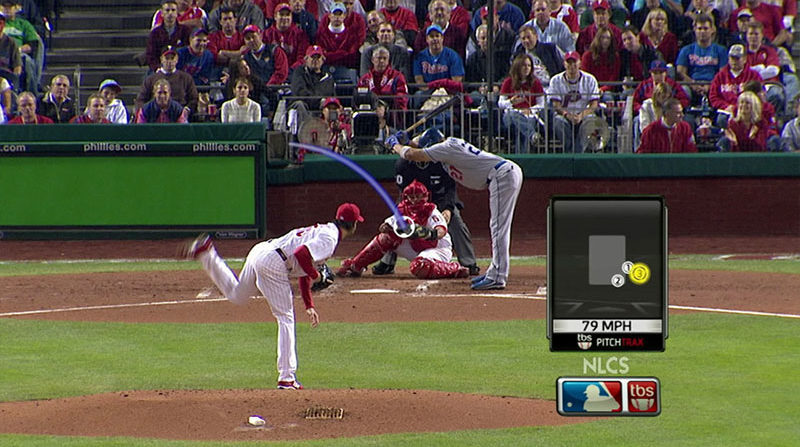
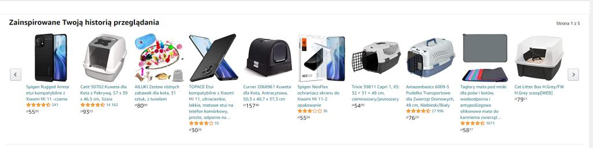
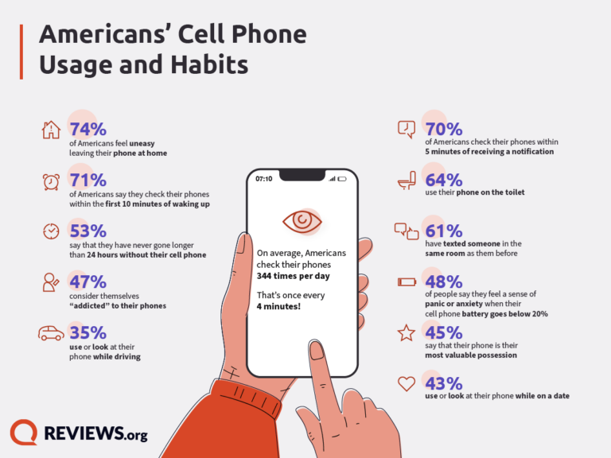
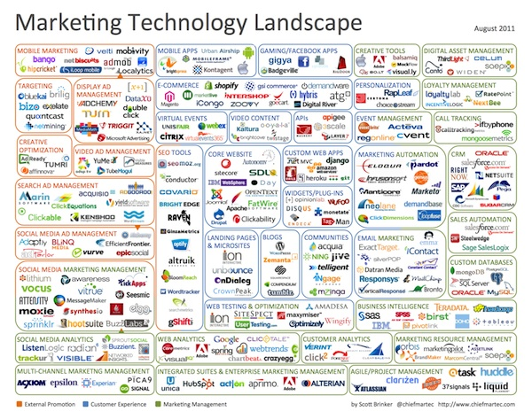
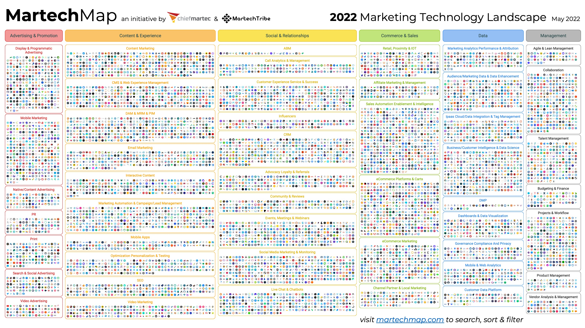
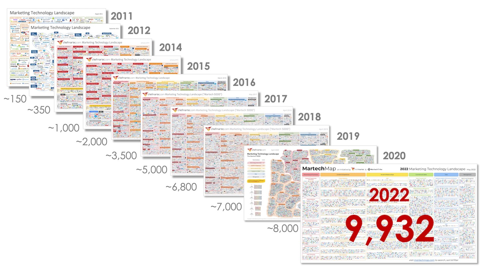
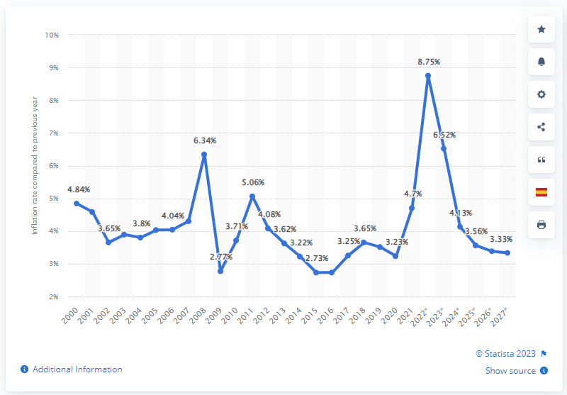

#  Introduction

Let's face it, data is everywhere in our current reality.  Have you noticed how much data has taken over our everyday lives?  If you are a fan of sports, try watching a football, basketball or hockey game while covering the little box that tells you the score and time remaining in the period.  It's maddening.  Even your favorite baseball game would not be nearly as good without Pitchtrax, and the box with the inning, score, and count.  

||
|:--:|
| <b>Image Credits - Sean Keeley (@Keeley_2018)</b>|

Recently, I've found myself watching pre-season baseball.  Major League Baseball has just introduced a new pitch-clock to try to speed up the game.  As a way to figure out how much time is remaining before the pitcher needs to throw a pitch, I find myself counting down from 15.  I'm sure by the time the regular season rolls around next month, FOX, ESPN and Sportsnet (some of the main TV broadcasters) will have found a way to relay that information to me.  But the point is that there is a data-related aspect of the game that, if we added it to the data I already have, will enrich my viewing experience.  More importantly, I will spend less time counting down the pitch timer and more time enjoying the game and listening to the announcer.

Think about that last sentence for a second.  I will spend less time counting down the timer and more time listening to the announcer.  Now, apply that idea to you presenting an idea in a presentation.  If people are spending time and effort on trying to understand your visual, they are spending less time listening to you.  Your goal should always be to have people to listen to you as you present data.

>  Example:  Major retailers like Walmart, Amazon and others use data they collect from millions of people who visit their websites and stores to recommend you products.  Indeed, there is a famous story about a father who phoned the complaints department at Walmart because Walmart sent his 16 year old daughter targeted marketing material meant for someone who was about to have a baby.  The material, which consisted of adds for strollers, cribs, cute baby shoes and other baby accessories, also had coupons for diapers and baby formula.  The father, furious that Walmart would send advertisements that might encourage his teenage daughter to have sex and get pregnant, yelled at the operator on the other end of the phone and demanded an apology.  
>
||
|:--:|
| <b>Image Credits - Arkadiusz Krysik, 2021</b>|
>
>  As it turns out, the daughter had made some purchases that Walmart's data team had flagged as strong indicators that the purchaser was pregnant.  The store then automatically sent out the marketing material without considering the age of the girl.  But, that's not the entire story.  It turns out that the girl was pregnant.  And, that's how Walmart knew a teenage girl was pregnant before her dad did.  


But, data goes far beyond these simple examples.  When you go online, you see adds.  These adds target you because of your online preferences, the sites you've visited and even parts of the website that you have hovered over.  These adds don't just happen to be for products and services you are interested in.  Massive amounts of data were collected.  You, and people with similar internet history to you, they will see similar adds to you.  Those whose internet history is different will likely see different adds.  The data drives the marketing.

We all have smartphones.  These phones track our steps, take care of email and text messages, track where we are, give us directions and help us navigate social media.  This data is all stored and can all be used by the service provider to give you better service.  Think about it - when was the last time you had to use a paper map to get somewhere?  Do gas stations still sell paper maps?  Our smartphone providers have vast amounts of data on you and where you've been.  By using the various apps on your phone, you have essentially given your phone provider an endless supply of data about you and your habits.

||
|:--:|
| <b>Image Credits - Trevor Wheelwright (@2022CellPhone)</b>|


The point is that data is all around us and those who use data are in a better position than those who don't.  Daryl Morey is an NBA executive.  He once said "Everyone in our business knows they need to visualize data but it's easy to do it poorly.  We invest in it.  We're excited if we can use it right while they use it wrong." (@Berinato_2016).  We hope that after reading this book, you will use it right.


##  Growth in Data

We are currently living through the greatest expansion in data that the world has ever seen and as a result, it is becoming increasingly important that we understand the data and know how to correctly use it.  Over 90% of the world's data has been produced in the past 2 years (@Marr).  The graphic below is from 2015 data and depicts the daily amount of data created.  All numbers are in billions.


||
|:--:|
| <b> Image Credits - Kevin Hartman (@hartmankevin2022) </b>|


The graphic gives an illustration of the amount of data created each day around the world.  The area of each box represents the relative area of the particular type of data being created each day.  For example, there are 4.5 billion facebook likes every day (you don't want to know how many dislikes there are).  We also have 2.5 billion Instagram photos viewed.  Knowing a little bit about people's online habits helps those in marketing and those in sales know where their potential customers are spending their online time.

The thing about data is that people often cannot appreciate large numbers.  A billion is a number that is too large for us to really picture in our minds.  So, you'll notice a couple of boxes are not labeled.  The large blue box represents the number of cups of coffee consumed each day worldwide.  As we know, one can get a cup of coffee anywhere in the world.  Certainly in North America, there seems to be a coffee shop on every major street corner in any busy city.  The brown box on the right side represents the number of votes cast in the 2016 US presidential election and the box in the bottom right corner is the number of books read daily (which should be a little concerning).


||
|:--:|
| <b> Image Credits - Kevin Hartman (@hartmankevin2022) </b>|

The point here is that there is a lot of data created every day.  The amount of online data created daily far exceeds the amount of daily data created at any other time in the history of the world.

Another interesting way to consider the volume of data is to look at how quickly it is growing.  Scott Brinker put together his infographic in 2011.


||
|:--:|
| <b>Image Credits - Scott Brinker (@Brinker_2011)</b>|


The graphic consists of company logos in the marketing technology space.  He categorized them and showed us the companies in the data space who are making sense of the data being generated.  Due to the positive feedback he received, he continues to make these graphics every year.  Here is the graphic from 2020.


||
|:--:|
| <b>Image Credits - Scott Brinker (@Brinker_2022)</b>|

Over time, there were 150 companies in the space in 2011.  That climbed to 350 in 2012 and continues to climb today where we currently sit around 9,932 companies.  Again, there has never been more widely available data.  There have never been more companies trying to make sense of the data.  If you can't make sense of data, you will be left behind in the data race.


||
|:--:|
| <b>Image Credits - Scott Brinker (@Brinker_2022)</b>|


##  The Data Story

If you want to communicate about your data, you need to tell a story.  To tell a story, you need three things: setup, conflict, and resolution.  Every story since the beginning of time follows that pattern.  You may have heard this pattern in a different way (perhaps: say what you're going to say, say it, say what you said).  In any event, most effective writing falls into this pattern where things are divided into three sections.  Call them what you like, the pattern of three is one of the most impactful ways of communicating.

Consider your favorite Roadrunner cartoon.  In the setup, Wile-e-Coyote constructs an elaborate trap for the Roadrunner at the side of a cliff.  During the conflict, Roadrunner runs through the trap and, for some reason, the trap isn't triggered.  The conclusion is when Wile-e-Coyote checks the trap, the trap catches him and he falls off the cliff into a puff of smoke.  "Meep meep!"

So, what are these parts of the story?  The setup is simply a state of affairs.  It could be the present state, a past state or a fictitious or future state.  It is the setting for the story.  The conflict piece describes what changes in the reality.  If there is no conflict, there is no story.  This is a difficult thing for many people to understand.  Authors need to give their audience a reason to care about what they are saying.  The conflict portion of the story is how you get your audience to care.  Finally, the resolution is what the reality changes into.  You can think of it as the new reality.

> Example:  Tell the story of the graph below:

 **Global Inflation Rate From 2000 to 2021, with Forecasts to 2027**

||
|:--:|
| <b>Image Credits - Statista (@Global_inflation_rate)</b>|
>
>
>  We can begin the story today in 2021.  We see inflation is 4.7%.  If we use this as the setup, we can then talk about 2 stories - pre 2021 and post 2021.  In pre 2021, the conflict occurs in 2008 with a large spike followed by a quick decrease in 2009 and another spike in 2011.  The spike in 2008, and the resulting dip and recovery, was due to the global financial crisis.  Other than that, there was not much movement in inflation between 2000 and 2021.  That's the story pre 2021.
>
>  Post 2021, there is projected to be a rather large spike in 2022/23.  This is due to the rising tensions between Russia and Ukraine and subsequent war that resulted.  This again is an example of the conflict and leads to the new reality that inflation rates will likely be higher for the next couple of years.

As you can see from the previous example, the setup does not need to be the reality at the beginning of the data.  It can be the reality at whatever point in the data the story is the most compelling.  If we had started the story in 2008, the conflict would only have been in 2023 and we would have missed an opportunity to tell a story about the spike in 2008.  So, be careful when you're telling a story.  It needs to be rooted in a setup reality that helps you deliver the best and most meaningful message to your audience.

One way you can emphasize each of these parts of the story is to separate them on separate graphs.  For example, if you want to talk about the war in Ukraine, you might begin by presenting a graph of the inflation changes from 2013 to 2020 as your setup.  You can discuss that inflation was fairly steady and that not much changed over those years.  You may wish to add in something about the average inflation and how all of those percentages are relatively close to the changing inflation rate.  You could also remind people that a small amount of inflation is actually good for the economy and it's not bad that the inflation rates were between 2.5% and 3.65%.  Then, for the conflict, you can show 2021 through 2024 and discuss how the war in Ukraine has caused a spike in the inflation rate.  What factors are causing the change?  How can we resolve the inflation spike?  Finally, this leads us into our new reality in 2025 and beyond.  By breaking the story down into parts, you can truly emphasize each part of the story and focus your audience's attention on the important aspects of the data.

>  Example:  Another example of storytelling comes from Andrew Moorfield - a banker who specialized on corproate finance for large banks in the United states.  In 2000, Andrew decided to open up his own small business lending company and lanuched bfinance.co.uk.  After some time had passed, Andrew had about 25 employees working for him.  He found himself in a position in which he couldn't make payroll.  Rather than presenting his staff with all of the numbers in the form of a spreadsheet and telling them what he intended to do, he sat them in the boardroom and wrote 5 numbers on a whiteboard.  
>
>  He wrote down the balance in the bank account at the beginning of the month (X), the revenues the company projected for the month (Y), the costs associated with making those revenues (Z) and the balance in the account at the end of the month (T).  This was the setup of Andrew's story.  $$ \begin{align*} &X\\+&Y\\-&Z\\ \hline &T \end{align*} $$ He then wrote the total salaries of his employees to the right of the T.   $$ \begin{align*} &X\\+&Y\\-&Z\\ \hline &T \;\;\;\;\; S\end{align*} $$  Of course, $S > T$.  He paused and let the reality of the situation sink in to his employees.  This was the conflict.  He then asked his staff what they wanted to do to resolve the conflict.  They decided amongst themselves to give full salaries to a portion of the staff while deferring the salaries from other members of staff until a later date.  They resolved the conflict.  By presenting the data in a simple and suscinct way, the staff came up with a resolution to the problem based on a very simple explaination of the data \cite{}.  

The moral of the previous example is that there was no reason to over-complicate the data.  That is often true when you present data to people who are not intimately familiar with the data.  The majority of Andrew's staff would not have been familiar with the accounting data.  Moreover, if Andrew had presented complicated financials, he probably would not have been able to convince his audience to find a simple and effective solution.  Story telling matters and the example of bfinance.com.uk demonstrates exactly that.


##  Why Data Visualization?


As companies make better use of their data, explaining the data becomes increasingly important.  Data visualization is a method by which we can communicate qualitative and quantitative data.  When creating a visualization, keep in mind the following quotation from Edward Tufte: "Clutter and confusion are not attributes of data - they are shortcomings of design.".  That is to say, when we display data, it needs to be clear, visually appealing and never misleading.


A question that one might ask is "why do we need to use data visualization anyway?".  We have all been taught that numbers don't lie.  Perhaps given a data set, all the information we need is stored in the numbers themselves.  If this is the way you think about data, you're half right.  Consider the following example.


> Example:
> Consider the following 2 data sets:
>
> $$\begin{matrix}
  x_1:   &4   &6   &4   &4   &4   &3   &4   &8   &8   &4\\
  x_2:   &2   &10  &2   &6   &0   &2   &2   &2   &4   &6
  \end{matrix}$$
>
>What can we say about this data?
>
>  * mean(x1) = 4.9, mean(x2) = 3.6
>  * var(x1) = 3.211, var(x2) = 8.711
>  * corr(x1,x2) = 0.2017
> 
> So, remembering back to first year statistics, we know now that the mean of $x_1$ is larger than the mean of $x_2$.  So, for each pair, the $x_1$ value tends to be larger.  Since the standard deviation of $x_2$ is larger than $x_1$, the values of $x_2$ are more spread out than the values of $x_1$.  The positive correlation coefficient indicates that there is a weak positive correlation between $x_1$ and $x_2$, so if $x_1$ increases, $x_2$ is likely to also increase. We can also take a look at things like the mean and median to determine if there might be some skewness to the data (or better, determine the kurtosis).

The previous example gives the impression that we know a fair bit about the data just from a few summary statistics.  Indeed, one may find a good amount of information about the data just through those summary statistics.  However, those don't tell the entire story.

>  Example:
>  Consider the following 2 data sets in 2 variables:
>
> $$\begin{matrix}
  x_1:   &10 &8  &13 &9  &11 &14 &6  &4  &12 &7  &5\\
  y_1:   &8.04 &6.95 &7.58 &8.81 &8.33 &9.96 &7,24 &4.26 &10.84  &4.82 &5.68
  \end{matrix}$$
> $$\begin{matrix}
  x_2:   &8 &8 &8 &8 &8 &8 &8 &19&8 &8 &8 \\
  y_2:   &6.58  &5.76 &7.71 &8.84 &8.47 &7.04 &5.25 &12.50  &5.56 &7.91 &6.89
  \end{matrix}$$
>
>We compute the same summary statistics for this dataset?
>
>  You will again find the following:
>
> * mean(x1) = mean(x2) = 9
> * mean(y1) = mean(y2) = 7.5
> * var(x1) = var(x2) = 11
> * var(y1) = var(y2) = 4.127
> * cor(x1,y1) = cor(x2,y2) = 0.8164
>
>  So, based on the summary statistics, the two data sets are basically the same.  They have the same mean x, the same mean y, the same standard deviation for x and for y, and even the correlation between the variables is the same.  However, the data sets could not be more different and a quick graph shows us exactly that.
```{r, echo = FALSE, fig.width=8, fig.height=6}
  x1 <- c(10,   8,    13,   9,    11,   14,   6,    4,    12,     7,    5)
  y1 <- c(8.04, 6.95, 7.58, 8.81, 8.33, 9.96, 7.24, 4.26, 10.84 , 4.82, 5.68)
  plot(x1,y1, xlim=c(0,20), ylim=c(0,14))
```
```{r, echo = FALSE, fig.width=8, fig.height=6}
  x2 <- c(8,    8,    8,    8,    8,    8,    8,    19,    8,    8,    8)
  y2 <- c(6.58, 5.76, 7.71, 8.84, 8.47, 7.04, 5.25, 12.50, 5.56, 7.91, 6.89)
  plot(x2,y2, xlim=c(0,20), ylim=c(0,14))
```

The point of the previous example (which is based on the ideas in Anscombe's quartet @Anscombequartet_2023) is that the numbers do not tell the entire story.  Thus, we need to be very careful how we present data, either in tabular form or in graphical form, to our audience.  

In the sections that follow, we will present some ideas to help display data in a form that is the most meaningful and helps facilitate correct interpretations.

##  Planning the Data Story

Now that we know that storytelling is an important part of communicating data, we turn our attention to we deliver the story.  Barbara Minto, a former consultant for McKinsey, developed a concept referred to as the Minto Pyramid Principal.


------------------------ ---
Minto Pyramid Principal: Any statement that is made must be supported by facts; moreover, the statement must be a perfect summation of those facts.
------------------------ ---

In order to achieve success with this principal, we use three of Minto's rules.  First, the most important statement that we make must be a good summarization of the elements (or facts) that we're using below it to support that statement.  Next, these facts should be all similar in some way.  Finally, the order that we present these facts should be in an order that is not surprising to our audience.  We want to make sure that they make sense to the audience.  To that end, we could order them from largest to smallest or we could list them chronologically, or in some other sensible order.  Together these facts should be mutually exclusive (having no overlap) and collectively exhaustive (fully supports the objective).  If you are able to achieve this type of structure, you have a well organized point.  You can combine multiple pyramids to create the full story for your audience.

||
|:--:|
| <b>Image Credits - Barbara Minto (@Minto_Minto_1996)</b>|


This type of structure can also help when you construct research questions.  What is the overarching objective?  What key-questions must we answer in order to fully evaluate the objective?  This will help guide what data we need and even where we might find it.


||
|:--:|
| <b>Image Credits - Adam Amran @MintoPyramid</b>|


##  Enriching The Story

Data is hard and numbers are confusing to most people.  There are some techniques that we can use to take some of the mystery out of explaining this data to people.

As an example, consider that the US consumes 7,117,500,000 barrels of crude oil annually.  That is a fact; however, it is difficult to visualize what that looks like.  The context is missing.  While the figure seems large, we do not have any emotional connection to it. The idea of millions or billions is lost on most people, so we need to reframe the context.

John Kenney has developed five different ways to frame or position numbers to help the audience make a connection.


###  Use of Units 

The use of units is important.  Use units that people understand.  For example, the idea of 7.1 billion barrels of crude oil is difficult to understand.  However, it is enough oil to make 36 billion plastic water bottles every day.  

Even though we use billions here, we have tied that number to something our audience understands.  Everyone knows what a water bottle looks like and it is difficult to imagine 36 billion of those each day.

###  Use Familiar Comparisons


A familiar comparison can be an effective way to communicate difficult to understand concepts.  Going back to the crude oil example, we can explain that 7.1 billion barrels of crude oil is enough for 39 trips to the sun and back each day.  In our minds, we know the sun is a long ways away.  While we do not think of it in kilometers, we know that making 39 round trips is enormous.  

Another comparison could be around time.  Americans use about 225 barrels of oil each second.  Here, while we may not know exactly what 225 barrels of oil looks like, we do understand the idea of 1 second.  Using 225 barrels of anything in 1 second seems like a lot.

###  Use Everyday Terms

Comparing the number to something that we do daily is a great way to connect the audience to a large number.  While we know that driving uses oil and that heating our homes uses oil, the processes associated with these is not necessarily obvious to most people.  However, we know how much water we use.  It turns out that Americans use 48 times more oil than water every day.  Since we understand our use of water (to drink, water the lawn, wash the dishes or clothes), knowing that there is almost 50 times more oil being used than water being consumed is crazy.

###  Use the Moral or Emotional Approach

A rather risky approach is to use something that elicits an emotional or moral reaction from the audience.  For example, in less than four decades, the world's finite supply of oil will be gone forever.  Now, the issue here is that this can have a polarizing impact on your audience.  Make sure you know your audience well enough to ensure that you don't alienate any of them and risk them shutting down.

###  Use a Personal Approach


Again, this approach takes the message back to each audience member.  A typical American family uses 70 barrels of oil.  While I don't know what 70 barrels looks like, it does strike me as a rather large amount that my family would be using.  In this example, 70 barrels for a household seems very high and possibly even gluttonous.  So, if your point is to persuade people to reduce, this might be very impactful.

These techniques will help establish an emotional connection with the audience and will help us either persuade them or connect with them.  It helps bring meaning to our story.  Graphics are often bad at conveying emotion.  These comparisons will help bring in the necessary emotion.


##  Best Practices

Obviously, there are many opinions on what constitutes best practices.  Use what follows as a guide.

###  Select Your Audience

When creating visualizations, consider the audience.

*  Who is the audience?
*  Who will be looking at this data? 
*  What are the challenges they face and what prevents them from overcoming those challenges? 

Do not create a visualization that meets everyone's needs; but rather, consider the needs of a smaller group of stakeholders.

###  Know Your Purpose

When selecting your graphic, consider why you are doing so.

*  What conclusion do I want the audience to draw?
*  Are there decisions (strategic, operational or tactical) that need to be made and how does my visualization help drive those decisions?

Do not simply include a visualization without a goal in mind.  Stakeholders need to be able to use your visualization to make decisions and in an appropriate time-frame to align with decision types.  Once a visualization is clear, insights can be drawn and action can be taken.

*  What actions do I want people to take with this insight?

Consider how your visualization will drive action.  If there are thresholds that need to be achieved or comparisons to be made, how will you include those in your visualizations?

### Select the Right Visual

Accountants like tables - everyone else likes visuals.  However, selecting the correct chart type is not trivial.  We will discuss different types of graphs in another chapter.


