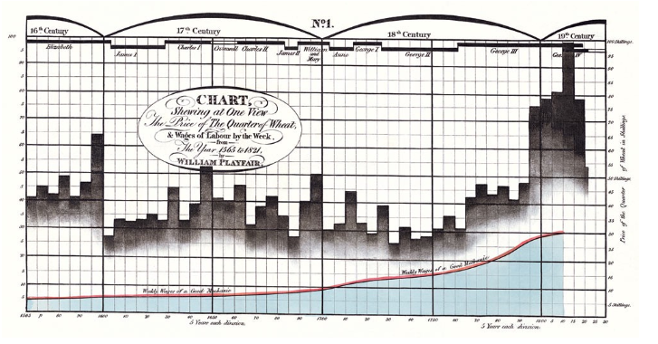
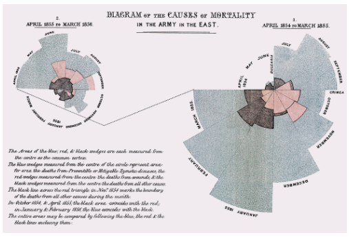
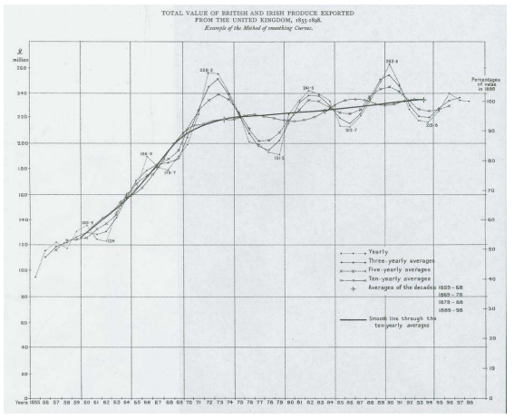

#  A Brief History of Data Visualization

It is important to see how data visualization has evolved over time.  Studying history can often be insightful  and can help illuminate the core foundation upon which this important topic in data science is built.  Seeing what innovative ways people used visualization will hopefully inspire you to be innovative yourself.  Finally, we hope that this historical perspective provides inspiration.  Consider that it took until the 1800's to invent the scatterplot.  What future plots and techniques might we still be able to discover?  

We characterize the evolution of data visualization in eight epochs (@Friendly:06:hbook).  The paper "A Brief History of Data Visualization" (@Friendly:06:hbook) is a great place to find additional information on the history of data visualization.

##  Epoch I - Pre-17th Century:  Early Maps and Diagrams

Indeed, the history of data visualization can be traced back to nearly the beginning of time.  In the first epoch, pre 1600, humans were using maps to make sense of their surroundings.  By making maps, this allowed people to share information about their surroundings with each other (@BBCDataScience).  While these maps tended to be imprecise, the information they were able to convey was still valuable.

||
|:--:|
| <b>Image Credits - BBC Data Science Art Project (@BBCDataScience) </b>|

The Tabula Peutinger is a Roman map used to move and position armies.  It shows the road system of the empire beginning in Britain in the west and finishing in India in the East.

In addition to geographical visualizations, people were using visualizations to collect information about planets.  Here is a graph indicating the position of the sun, moon and planets.

||
|:--:|
| <b>Image Credits - Funkhouser, 1936 (@Dixinproceedings) </b>|

##  Epoch II - 1600 - 1699:  Measurement and Theory

The second epoch begins in the 1600's around the beginning of the scientific revolution.  During this epoch, many of the core values of scientific thinking were established, specifically, this epoch is characterized by precise measurement.  Around this era, problems concerned with physical measurement of time, distance and space were among the most important.  Thanks in part to the contributions of Descartes and Fermat, this century saw the rise of analytic geometry.  Pascal and Fermat also gave us the beginning of probability theory.  

Christopher Scheiner created a visual telling the story of sun spots.  Scheiner, a priest, studied sun spots in an attempt to reconcile Church teachings that the Cosmos had no imperfections with the visual evidence that it did.  The image shows sunspots from October 23 through December 19, 1611.  One can see the seven sunspots identified in the key in the upper left corner of the visual and the corresponding spots in the lower images.

||
|:--:|
| <b>Image Credits - Scheiner, 1630 (@Cararticle)</b>|

Michael Florent van Langren was a Flemish astronomer who produced what is widely believed to be the first visual representation of statistical data(@Tufte_1997).  Here, he displays the 12 known estimates of the difference in longitude between Toledo and Rome.  While this data could be very simply be shown in a table, his use of a graphic illustrates the wide range in variation between the estimates.  The middle of the range (a gap in which he inscribed "ROMA") was his estimate of the true longitude.  Incidentally, the true longitude is $16^o30'$ as depicted by the arrow at the bottom of the graphic.  This graphic also was an early example of one in which we have negated the effect of ordering bias in a visualization.

||
|:--:|
| <b>Image Credits - Tufte, 1997 (@Tufte_1997)</b>|

During this epoch, we also see the first bivariate plot of a theoretical curve relating barometric pressure to altitude as well as the first known weather map of wind (@Sridharan_2017).

||
|:--:|
| <b>Image Credits - Sankaran (@StatisticalDataVisualization)</b>|

Several governments begin collecting social data in this century.  The goal of this data collection, termed "political arithmetic", was to gain insight in matters related to wealth, agriculture, land, population, taxes, etc.  Some of this data was used for the purposes of annuities and insurance and came about by way of life tables.  By the end of the century, all of the necessary elements for visual thinking were beginning to fall into place.

## Epoch III - 1700 - 1799:  New Graphical Forms

In the third epoch, artists are beginning to explore different visual forms and creative forms of communicating data in an attempt to quickly generate insights.  Specifically, timelines, cartograms, functional interpolations, line graphs, and bar charts were established and being put to use.  Additionally, contour and topographical maps began to show up.

During this time period, three-colour printing was invented thus bringing about an additional mode to encode data.  The cost of replication, however, made wide circulation impossible.

##  Epoch IV - 1800 - 1850:  Beginnings of Modern Graphics

Epoch four is the beginning of modern graphics.  By this point, all of the major forms of data display have been invented: line, bar, and pie charts, histograms, time-series, contour, and scatter plots, etc.  From cartography, maps evolved to atlases involving a wide range of symbolism and dealing with  a variety of topics (economic data, medical data, etc.).  Geological maps made their first appearance at the beginning of the century.  These types of diagrams began to regularly appear in scientific papers, too.

William Playfair introduced this graph which depicts the price of wheat juxtaposed with the change in wages.  Visuals produced with this data allowed for the study of economic problems.  Playfair also was one of the first to experiment with composing multiple graphs to determine relationships between variables.

||
|:--:|
| <b>Image Credits - Sankaran (@StatisticalDataVisualization) </b>|

During 1931, the first case of cholera occurred in Great Britain with over 52,000 deaths in the ensuing epidemic.  Dr. John Snow and Dr. Robert Baker both studied the phenomena.  Baker created a map of cholera showing the districts of Leeds impacted by cholera during the 1832 outbreak.  Baker's map did not lead to any answers about how to treat or cure cholera.  At the time, it was unknown how the disease was transmitted.  Baker shaded the 1800 cholera cases which were divided into “the districts in which the cholera had prevailed.” There was a note in his report pointing out the association between the disease and living conditions: “how exceedingly the disease has prevailed in those parts of the town where there is a deficiency, often an entire want of sewage, drainage, and paving” (@Gilbert_1958).  However, there were not incidence rates nor data about population density on the map.  This left his conclusions weak.

||
|:--:|
| <b>Image Credits - Gilbert (@Gilbert_1958)</b>|

Fast forward a few years, toward the end of epoch 4 and the beginning of epoch 5, and Dr. John Snow produced a graph of Cholera cases with each death marked by a dot.  The dots appear clustered around the Broad Street pump in London leading to both the discovery that the pump was causing the spread of cholera and that, in general, cholera is spread by liquid.

||
|:--:|
| <b>Image Credits - Gilbert (@Gilbert_1958) </b>|

##  Epoch V - 1850 - 1900:  The Golden Age of Statistical Graphics

The fifth epoch is the golden age of data analytics.  This begins in the mid 19th century.  We attribute this epoch with artists collecting data and using visualizations to communicate the data.  It is a transition from an era filled with enthusiasm to the golden age.  

We find John Snow's cholera graphic right on the border of these epoch 4 and 5. Florence Nightingale's illustration of the need for greater sanitary conditions among the British army.  In her visualization, we clearly see that more soldiers died from disease and the consequences of wounds than in the battles themselves.  These were but a few examples of the innovations in graphical design that were invented over this period.

||
|:--:|
| <b>Image Credits - Sankaran (@StatisticalDataVisualization) </b>|

We also see the visual telling the story of Napoleon's march to Moscow and then return home.  This visual shows the number of soldier lives lost, the temperature and the distance traveled. 

||
|:--:|
| <b>Image Credits - Sankaran (@StatisticalDataVisualization) </b>|

Francis Galton, well known for his work in correlation and regression, helped develop statistical insight from visualizations.  He noted that in a normal distribution, the isolines of equal frequency would appear as concentric ellipses and that the locus of the regression lines of the means of $y|x$ and $x|y$ were the conjugate diameters of these ellipses.

Galton's work extended to notable non-statistical graphical discoveries such of those involving counter-clockwise patterns of winds around low-pressure regions combined with clockwise rotataions around high-pressure zones.  This work is summarized in Meteorographica (1863) (@galton1863meteorographica).

However, one of the most important works of this epoch was the Albums de Statistique Graphique published by the French ministry of public works (1879 -- 1897).  Under the direction of Emile Cheysson, these large format books (11 x 17 in) contained a multitude of economic and financial data related to planning and development.  Most significanly, this book can be seen as an overview of the various graphical techniques known at the time.

However, among the many beautiful stories, there are some issues in this epoch.  Toward the end of the century, the Albums de Statistique Graphique were discontinued due to the high production costs. In some cases, visuals become too complicated for interpretation.  In other cases, the graphics overwrite the story of the data.

## Epoch VI:  1900-1950: The Modern Dark Ages

After the fifth epoch, a bit of a revolution begins.  There were few innovations during this period.  Formal models supplanted the enthusiasm for visualization which was so plentiful during the late 1800s.   We can classify this epoch as the modern dark ages of data analytics.  

During this era, academics revolt in an attempt for more accuracy, control and a standardized language. Creativity for the sake of creativity is limited and a push for accuracy is introduced.  

However, during this period, we find that the population gains an overall acceptance of graphical techniques.  Graphics become mainstream.  They begin showing up in English textbooks, in commerce and in science.  Indeed, Sir Arthur Bowley's textbook (1901) Elements of Statistics (@Ford_1901) devoted two chapters to the construction and dissemination of graphs and diagrams.  These chapters deal with visual elements such as scale, visual estimates of differences and ratios, smoothing of graphs, 3D graphics and multiple plots overlayed on the same graph.  One example is Arthur Bowley's graph depicting several exponential smoothings of a time series graph showing a 10-year trend in exports.

||
|:--:|
| <b>Image Credits - Bowley, 1901 (@Ford_1901) </b>|

A push for standardization in graphs culminated in a set of standards and rules for graphical presentation adopted by the Joint Committee on Standards for Graphic Presentation in 1914.

##  Epoch VII - 1950 - 1975:  The Re-birth of Data Visualization

Three significant developments occurred during the mid 1900's which shaped the rebirth of data visualization during this era.  

First John W. Tukey published a landmark paper titled The Future of Data Analysis (1962) in which he issued a call for the recognition of data analysis as a branch of statistics.  He also invented what he called Exploratory Data Analysis (EDA).  This consisted of a number of graphs (stem-leaf plots, boxplots, hanging rootograms, two-way table displays etc.) that quickly became commonplace.  

Next, Jacques Bertin published Semiologie Graphique (1967).  This paper is the data visualization of the periodic table in that it organized visual and perceptual elements of graphics according to features and relations in data.

Finally, and perhaps most importantly, computer processing of statistical data began.  FORTRAN, one of the first computer languages, is developed in 1957.  By the late 1960s, mainframe computers were widely available at many universities.  This lead to the ability to construct graphs by computer program.  Indeed, statistical applications became available (though, they were not yet widespread).  As a result, more data can be analyzed in more sophisticated ways.  We are able to add different graphical elements that we didn't have previously.

By the end of the period, there were the beginnings of collaborative computer science research, developments in data analysis and new display and input technology.  We begin to hear of ideas related to new ways to visualize multivariate data, the development of dimension reduction techniques and perceptually based theory of graphical attributes.

##  Epoch VIII - 1975 - Today:  High Definition and Dynamic Visualization

Today's epoch can be called high-definition data analytics where visuals are now almost always created with the assistance of computers.  We take advantage of all of the insights we learned from past epochs to create very powerful visuals.  Indeed, visualizations now have surpassed human creativity.

A few recent highlights include the development of interactive graphics, new methods for visualizing highly dimensional data, the application of visualization techniques to a growing list of problems and an increased focus on how data is perceived.

Of course, these developments are substantially aided by advances in statistical software such as R, SAS, Python, Power BI, etc.  A substantial increase in computer speed has aided these software.  We have also seen advances in classical statistics in which we move toward wider domains.  Indeed, statistics has evolved to the point where it requires a new name - Data Science.  While statistics and data science are not the same, there is substantial overlap.  Colloquially, data science involves the collection, organization, analysis and visualization of data (typically, large amounts of data) while statistics typically uses mathematical models to quantify relationships between variables and outcomes and makes predictions based on those relationships.

##  Today's Data Visualization Tools

There is a very quickly changing and dynamic market for visualization tools.  For simplicity, one way to consider the market for data visualization tools is to evaluate them in terms of ease of use and of capability.  Ask yourself if the tool is simple to use and simple to learn.  Can I quickly get the tool to do what I want it to do.  In this way, ease of use is important.  Assessing the capability is a bit different.  Some tools do one specific task very well.  Others are useful for a variety of tasks.  So, one might need to weigh the capability of one tool against a set of different tools that accomplish the same tasks.  Is broad better than specific?  It truly depends on the tool.

||
|:--:|
| <b>Image Credits - Kevin Hartman (@hartmankevin2022)</b>|

These tools are laid out on the graphic above.  Clearly, there are four quadrants in this figure.  

The upper left quadrant is filled with tools that are easy to use but limited in scope.  These tools might be appropriate for one-off tasks.  For example, Wordle is a very easy to use software that creates word clouds.  You need almost no training to use it; however, it does nothing other than word clouds.

The upper right quadrant is full of tools that are both powerful and easy to use.  Products like Plotly and Power BI are both fairly powerful and relatively simple to use.  These types of products should be your default tools - tools that you use for everyday visualizations.  Try to spend 75% of your time with products in this quadrant.

In the lower right quadrant, we find tools that are incredibly powerful but quite difficult to learn.  So, the power we get from the tool is offset by the awkward nature or the difficult learning curve.  While these tools may require some time to learn, they tend to be incredibly powerful.  Some of these tools are among the most important tools for you to know how to use.

The bottom left quadrant is filled with software that is both limited in scope and difficult to use.  These tools really do not need your attention.  Typically, these tools can be replaced with something that is at the same level of difficulty but much more powerful, or something that is just as limited in scope, but is much simpler to use.

One thing we need to do is remember that the market for analytics tools is ever-changing.  Thus, remain flexible and as the market changes, be prepared to change as well.  You can't stay on top of all of the different tools; however, do some investigation and see what tools might work best for you.  Replace less powerful and difficult to use tools with simple powerful tools.
