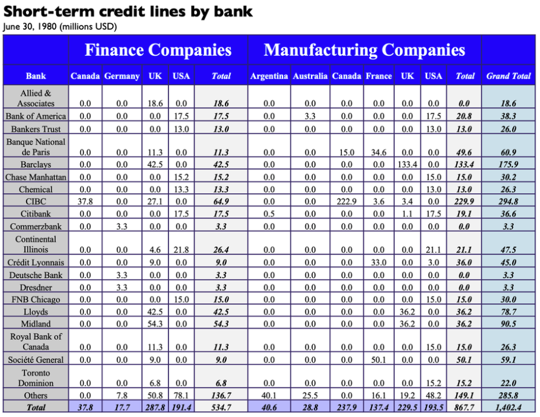
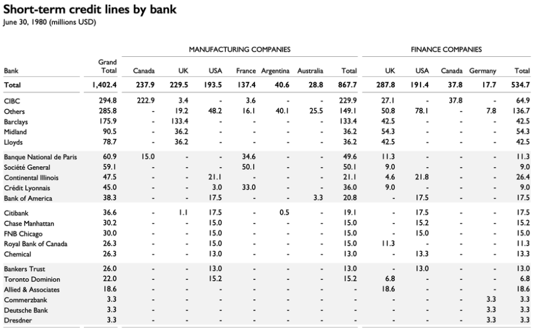
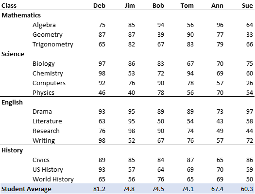
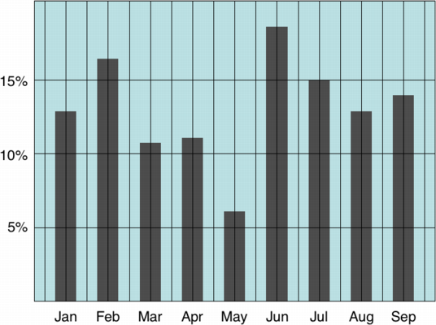
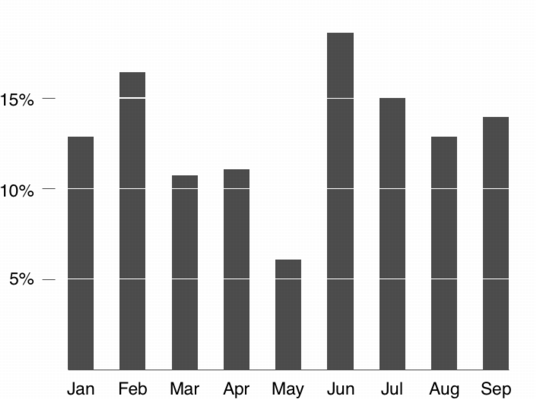
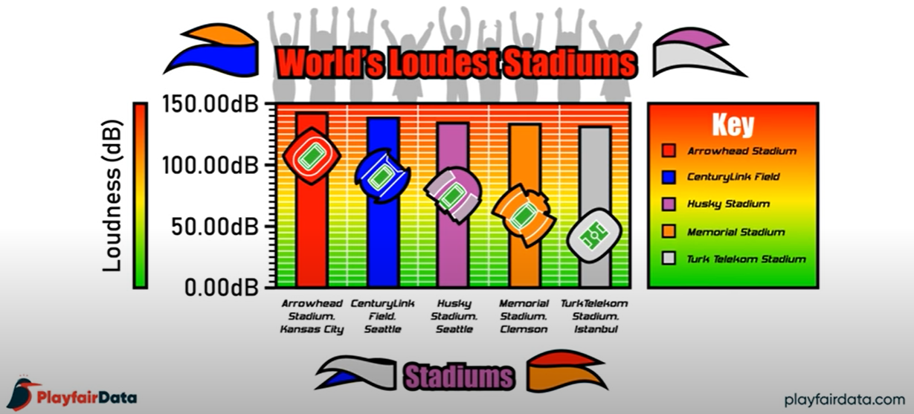
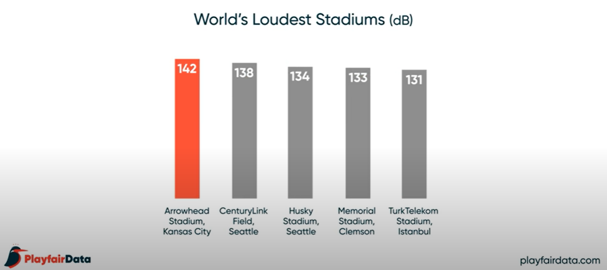

#  Think Data Ink

##  Data Ink

Data ink is the amount of ink, in a printed table or graph, used to display the data.  Non-data ink is the amount of ink in a printed table or graph that does not contribute to displaying the data.  Edward Tufte's guiding principle is that when you display data, you want the highest possible **data-ink ratio**.

----------- ---
Definition: The data-ink ratio is the amount of ink used to display data as a ratio or percentage of the ink used in the graphic overall.
------------ ---

Mathematically, we can think of the data-ink ratio as 

$\begin{align*} \text{Data-Ink Ratio} 
&= \dfrac{\text{Amount of ink used to display the data}}{\text{Total amount of ink used in the graphic}}\\ \\
&= 1 - \text{the proportion of the graphic that can be erased}. \end{align*}$  

Tufte argues that the closer this ratio is to 1 (or 100\%), the better the graphic is and clearly, this can be achieved by removing unnecessary parts of the graph or table.

One should be careful, however.  The data-ink ratio is somewhat fictitious and very difficult to actually calculate.  Rather, it serves as a guide for how to create graphs and tables.  It is a state of mind rather than a number that is to be calculated.  We want graphics that display data and have very little else included.

To that end, Tufte proposed five guiding principles related to data-ink (@Tufte_2001:

*  Above all else, show data.
*  Maximize the data-ink ratio.
*  Erase non-data-ink.
*  Erase redundant data-ink.
*  Revise and edit.

##  Tables

The ideas from Tufte apply equally to tables and graphs.  Tables list records and consist of rows and columns. Tables can show a lot of information in a structured way but may overwhelm people especially when the goal is to flush out trends.  To that end, apply Tufte's principles to tables.

*  Avoid extra gridlines.  Increase the data-ink ratio by removing any lines that do not add to the overall readability of the table.
*  Right align numbers to show differences in magnitudes.  This is a simple way to have a quasi stem and leaf plot embed in your table.
*  Left align words in a column.  This simply keeps words separate from numbers.
*  Align column headers with the data.  That is, right align column headers for numbers and left align column headers for words.
*  Round your numbers to a place that makes sense.  Accountants need more significant digits than managers typically.
*  Consider cross-tabulation rather than clean data.  While long data is very useful for analysis, wide data is often easier to us to tell a story.
*  Keep aesthetics of the rows and columns consistent.  If you have different widths, fonts, typefaces or colour, the reader is drawn to those rows or columns.  Adding different aesthetics should be done only when you wish to draw people's attention to those attributes.
*  Often 0's can be removed if the 0 represents an NA.  They can be replaced by a hyphen.
*  Sort the table in a sensible way.  Alphabetical order is ALMOST NEVER the best way to sort a table.  Sorting by a total will increase the ease of quick comparisons.  
    
>  Example:  The table below is courtasy of SimplexCT and is available [here](https://simplexct.com/data-ink-ratio-tables).
>
||
|:--:|
| <b> Image Credits - Case Problems in Finance, 10th edition </b>|
>
>  This table shows all of the data required to investigate short-term credit provided to a multinational company by various banks.  However, it is busy and difficult to pull any coherent story from.  We can clean this up using Tufte's principles:
>
>  *  Create consistent row height and column widths.
>  *  Right align all numbers so the reader can quickly see differences in size.
>  *  Right align column labels for columns of numerical data.
>  *  Remove background colours and unnecessary gridlines.
>  *  Remove bold and italics typeface.
>  *  Remove redundant labels.  This includes changing 0.0 to -.
>  *  Increase the font size of the data and reduce the font size of the labels.
>  *  Sort the rows of the data by grand total in decreasing order.  Sort the columns of the data by Total for each country.
>  *  We moved the row total to the top.  We also moved the Grand Total column next to the row label.  This tells the story of which banks we have the most credit with and how that credit is broken down.
>  *  Add breaks and a tint every 5 rows to enhance readability.
>
>  The final table is below.
>
||
|:--:|
| <b> Image Credits - Case Problems in Finance, 10th edition </b>|
>

The previous example demonstrates that even a fairly normal looking table can be improved by a few small changes.  Indeed, most of what we changed in the previous example were put there intentionally by the table designer.  Don't waste time adding unnecessary design elements to a graph; rather, keep it minimalist and help your audience to understand the data rather than admire your creativity.

>  Example:  The table below has a low data-ink ratio.  Fix the table so that it has a higher data-ink ratio and is easier to read.
>
||
|:--:|
| <b>  </b>|
>
>  To fix this table, we can do the following:
>  
>  *  Remove the gridlines.
>  *  Group the subjects into class types and group classes of the same type together.
>  *  Group STEM classes separate from English and History
>  *  Order columns by student GPA
>  *  Groupings add natural breaks between subjects, so there is no need to add shading.
>  *  Calculate student GPA at the bottom.  Highlight this total with a different colour or a horizontal line.
>
>  Depending on the story, you may wish to include other features.  If we are telling a story about which students had the highest GPA, we may wish to move the Student Average row to the top.  We may also chose to highlight (with bold face) the student who did the best in each class or the class that a particular student did the best in.  We may require subtotal averages for each subject area or the average GPA in each subject area.  All of these features depend on what story we want to tell the reader.
>
>
||
|:--:|
| <b>  </b>|

##  Graphics

We have seen how the data-ink ratio, and Tufte's other principles, can be used to create effective tables.  We now turn our attention to applying these principles to graphs.  Below is a graph that does not closely follow Tufte's principles.  

||
|:--:|
| <b> Image Credits - Tim Bray (@Synthesis)</b>|

The graph above is full of what we call "chart junk".  There is background colour, there are too many grid lines, and the extra additions distract from the message of the chart.  Removing the extra gridlines and background colour make the chart much more focused on the data.  Adding whitespace where the horizontal lines would have been allows the reader to quickly identify the rough height of each bar.  

||
|:--:|
| <b> Image Credits - Tim Bray (@Synthesis)</b>|

All told, this histogram removes the distractions and lets the reader focus on the data and the story.  Remember, the harder your audience needs to work to understand the chart, the less they are paying attention to what you're saying.

>  Example:  The point of the following graphic is to convey which sports stadium is the loudest.   Which stadium is the loudest and by how much (a lot or a little)?
>
||
|:--:|
| <b> Image Credits - Playfair Data (@DataInkTableau) </b>|
>
>   The takeaway to most casual observers is that Arrowhead Stadium in Kansas City is the loudest of the five by a fairly wide margin (look at the stadium pictures - it is a wide margin, clearly).
>
>  Below is the same graphic, transformed with the principles of Tufte.  It shows a much different story.
>
||
|:--:|
| <b> Image Credits - Playfair Data (@DataInkTableau)</b>|
>
>  Arrowhead Stadium is still the loudest.  However, the difference between Arrowhead Stadium (the loudest) and TurkTelekom Satdium (the 5th loudest) is fairly negligable.  The extraneous bells and whistles in the first graphic distort the message which should be that there is not much difference between the five loudest stadiums in the world (< 10% difference).

##  Exercises

1.  Show that the 4 datasets that comprise the Anscombe's Quartet data have the same mean for $x$ and $y$, the same standard deviation for $x$ and $y$, and that the correlation between $x$ and $y$ are the same across the 4 datasets.  Plot the 4 data sets to show that the pictures are different.  The datasets can be found [here](https://en.wikipedia.org/wiki/Anscombe%27s_quartet).

2.  Duplicate the analysis in the previous question using the DatasauRus data set found [here](https://www.autodesk.com/research/publications/same-stats-different-graphs).

3.  Recreate the table in the "Student Grades" example to tell the story of "Which classes are the easiest".

4.  Recreate the table in the "Student Grades" example to tell the story of "Which classes are students scoring over 80% in".

5.  Recreate the table in the "Student Grades" example to tell the story of "Which students are in academic trouble".

