#  Planning Your Visualization

Once we have data, the next task is to select the appropriate graphic.  Obviously, using visualizations will capture some patterns that are not easily seen through tabular data.

A fantastic reference for this is a book by Scott Berinato titled "Good Charts" (@Berinato_2016).

##  When a Visualization Hits our Eyes

Berinato (@Berinato_2016)introduces five ideas we should all be familiar with when it comes to visualization.  The first is that, in contrast to reading and writing, visualizations do not work left to right and top to bottom.  That is, we do not take in visual data the same way we take in written data.

|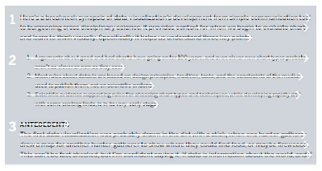|
|:--:|
| <b> Image Credits - Berinato (@Berinato_2016) </b>|

Rather, in a visualization, readers explore the data based on other factors.  Factors like size, shape, colour, etc. influence where our eyes are initially drawn.  The title, for example, may not be the first or even second part of the chart that we see.  We also pace differently when we read a visualization as compared to a book.  We do not spend the same amount of time on each part of the graphic as opposed to spending a similar amount of time on each sentence.  Our eyes go where they are drawn and we spend as much time as we wish.  This would also imply that those more accustomed to reading visualizations will take in visual information differently than those with little experience.

|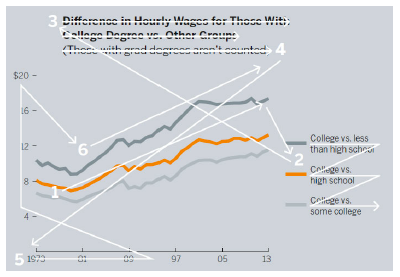|
|:--:|
| <b> Image Credits - Berinato (@Berinato_2016) </b>|

The next idea Berinato introduces is the idea of catching the reader's eye with the most important part of the visualization.  Berinato points out that "[w]e see first what stands out" (@Berinato_2016).  Our eyes, by their very nature, are drawn to change.  Changes can come in a variety of forms including colour, peaks, valleys, outliers etc.  The best charts are so simple that we understand them without knowing anything about their context.

|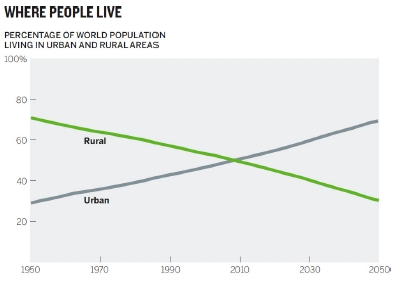|
|:--:|
| <b> Image Credits - Berinato (@Berinato_2016) </b>|

This chart contains an intersection.  This likely was the first thing your eye was drawn toward.  You (likely) may have not even bothered initially to see the year of the intersection.  More likely, you saw the crossover, checked the chart labels, read the title and concluded that more people currently live in urban areas compared to rural areas.

Berinato gives the following example.  What do you see first?

|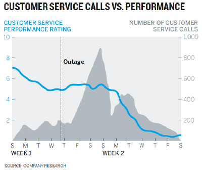|
|:--:|
| <b> Image Credits - Berinato (@Berinato_2016) </b>|

For most people, the peak, the blue line and the horizontal outage line are the first things that they see.  So, if the idea you are trying to convey has to do with those things, this is likely a successful graph.  If the idea was to convey that customer service has been in decline and the decline has little or nothing to do with the outage, this graph probably does not tell the correct story. 

If you are trying to tell the story of declining customer service, the data related to the outage is irrelevant and only complicates the diagram.  Moreover, if the decline is largely unrelated to the service outage, perhaps adding a line that shows when service is restored would help tell the story that the outage was not the issue.  Showing that the decline continues to occur after the service is restored speaks to unhappy customers even after everything is back to normal.  Finally, the new title makes the idea clear.

|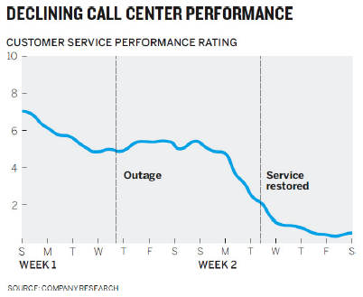|
|:--:|
| <b> Image Credits - Berinato (@Berinato_2016) </b>|

The third point that Berinato brings forward is that it is impossible to see a large number of things simultaneously.  In this first diagram, we see a very nice graph indicating the increase in performance from the entire team.  Their ratings all seem to increase.  

|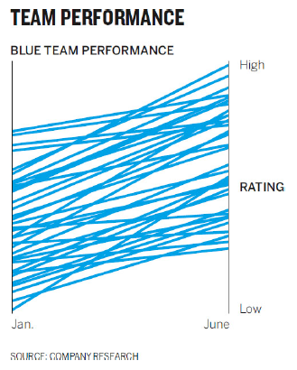|
|:--:|
| <b> Image Credits - Berinato (@Berinato_2016) </b>|

However, it is impossible to see individual employees within the mess.  Rather, the second graph shows the overall trend of the group as well as a few particular employees.  The use of shade here allows us to easily see a few key individuals.

|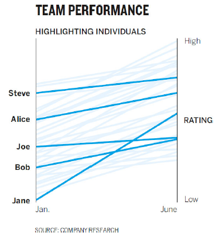|
|:--:|
| <b> Image Credits - Berinato (@Berinato_2016) </b>|

The fourth idea made by Berinato is that it is natural for us to seek meaning and connections.  When thinking back to the original graph about declining customer service, how many of us initially tried to make a connection between the blue line and the shaded peak.  It turns out that there was none.  But, that was the first thing many of us tried.  The point is that it is most people's natural inclination to do so.

Of course, there are some advantages of having this attribute.  We process visual information far more effectively than we do written information.  For example, if your apartment building is on fire, written instructions are far less appropriate than a quick map.  The map below is far simpler than a written description of the plan.  Consider what the written directions would be to get out of the building and how many of them you would need for each room compared to a diagram.

||
|:--:|
| <b> Image Credits -  Berinato (@Berinato_2016) </b>|

Making sure that we don't accidentally create unintended associations in the information is vital.  Consider the graph below.

|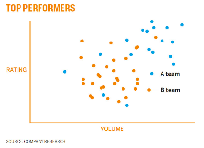|
|:--:|
| <b> Image Credits -  Berinato (@Berinato_2016) </b>|

Here, the use of colour might accidentally cause people to associate orange dots with top performers even though the use of that colour was done so without meaning.  Team A clearly out performs Team B and every aspect of the graph should point to that fact.

The final point made by Berinato is that people tend to rely on conventions and not on metaphors.  We rely on having seen previous graphs to give us insight as to what is happening in the graph we're currently looking at.  The graph below is the customer service graph with the axis swapped.

|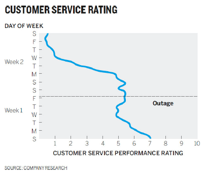|
|:--:|
| <b> Image Credits -  Berinato (@Berinato_2016) </b>|

What you might notice is that it takes significantly longer to determine what is happening.  We expect a numerical axis to be vertical and a categorical or time series axis to be horizontal.  The point here is that it takes a lot of effort to determine what the graph says.  Having the client spend time trying to decipher the graph takes time away from then listening to you present it.  Conventions come from expectation and our brain uses experiences and expectations as cognitive shortcuts so that we don't need to process everything.

Similarly, we would have the same reaction if someone showed us a map of the world where north was down and south was up.  While there is no "right side up" when it comes to an object floating in space.  Other conventions are that red is "hot" or "active" while blue is "cold" or "inactive".  Light shades are considered empty while darker ones are full.

Here is a little subtler example.  If we dig in, what initially appears to be a well constructed pie chart is actually quite problematic.  We are forcing people to work harder than they need to in order to understand the data.

|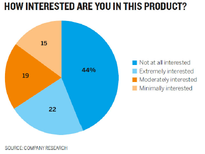|
|:--:|
| <b> Image Credits -  Berinato (@Berinato_2016) </b>|

We make the following connections without considering them:

*  Like colours mean like items - blue things should go together.
*  Colour saturation indicates higher and lower values - light colours should have less value than dark ones.
*  Categories should go from one extreme to the other - make the order of the key sensible.

It is an interesting exercise to remake this graph using correct conventions.  By looking at the chart as it is, consider if you can answer the following question quickly: what group makes up the majority - Interested or not interested?  Compare it to the graph below.

|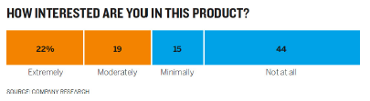|
|:--:|
| <b> Image Credits -  Berinato (@Berinato_2016) </b>|

By not following convention, you risk your audience not trusting your ability.  The chart will not be judged negatively - you will.

##  Two Questions You Should Ask

When you begin the process of constructing a visualization, two questions are important to ask  (@Berinato_2016):

1.  Is the information data-driven or conceptual?
2.  Is this an exploratory analysis or am I declaring something?

We begin with the first question.  If your information is conceptual, you likely want to focus on ideas with a goal of teaching.  Conceptual visualizations can be things like Org-charts, cycle diagrams, blue prints, road maps, or concept map type visuals.  These visuals tend to give a message or create a direction for future work rather than having anything to do with data.

If your visual is data driven, you are likely to rely on statistical techniques with a goal of informing your audience.  While these visuals can sometimes be conceptual, they are always rooted in some sort of measured value.  Typical statistical graphs are great examples of data driven visualizations.

The second question asks if the visual meant for exploratory analysis or is it declarative.  If it is exploratory, the focus is likely on prototyping.  It will be an iterative process where you will find yourself adding and subtracting from the visual.  It is often a process of discovery, too.

Declarative visualizations are often seen as the final product of an analysis. They are often what managers aim for when they ask for an analysis.  They focus on documenting the analysis with a goal of affirmation or persuasion.

It is important to note that oftentimes exploratory graphs end up as declarative graphs by the end, through the process of refinement.

We combine the two questions in a 2 x 2 grid as we so often do.

|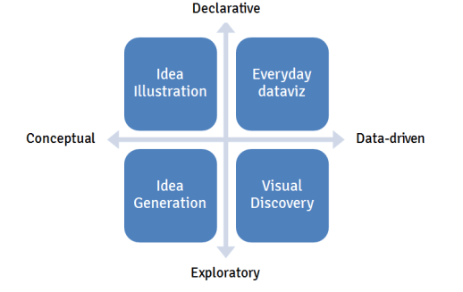|
|:--:|
| <b> Image Credits - Daniel Mullins (@International_Mullins_2017) </b>|

If your chart is declarative and conceptual, it is referred to as idea illustration.  These types of visuals illustrate process and framework.  They should be clear and simple in nature and are often metaphorical (ie, think of visuals with funnels).  Often used for presentations and teaching, they focus on simplifying concepts.

A visual that is conceptual and exploratory is referred to idea generation.  It is a little like brainstorming.  We come up with ideas and see if they stick.  Information here tends to be complex and so requires creative, often metaphorical, visualization features.  These types of visuals are often seen in brainstorming sessions with a goal of discovery, simplification or learning.  Think of these diagrams like "napkin drawings" or "whiteboard drawings".

Visualizations that are data driven and exploratory are those made in an EDA.  These are often the most complicated type of visual.  We do not know what the story is yet, but we want to use data visualizations to find out.  It is important to flush out patterns and generate hypothesis in this quadrant.  Normally, we will look for patterns, of which there are five:

1.  Change
2.  Clustering
3.  Relativity
4.  Ranking
5.  Correlation

Each of these reveal a story and each of them have a variety of visualizations associated with them.  For example, a line graph is a nice way to illustrate change over time.  Relativity might be best viewed with a bar chart.  The moral here is that once we know what we're looking at, we can pick the appropriate chart to augment the story.

A declarative and data-driven visualization occurs when we know what the story is and we want to communicate the story.  This is what we do regularly and so it is referred to as everyday dataviz.  Normally, the data here is fairly simple and is shown using conventional charts.  These visualizations are best when they are clear and simple and are presented with a goal of affirming or setting context.  Remember, presenting this type of visual will often require a story.

|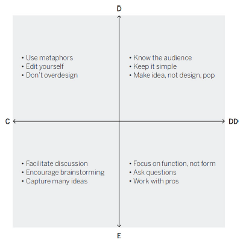|
|:--:|
| <b> Image Credits - Scott  Berinato (@Berinato_2016) </b>|

Remember, each of these visualization types is important.  You are likely to use everyday viz and visual discover about 70% of the time, with idea illustration and generation the remaining 30%.  As new software emerges, these numbers will likely change.

Taking a few minutes and asking yourself the two questions will often save you significant time as you create your visual.  This truly is a case where using a dash of prevention at the beginning will save you from having to take a cup of remedy in the end.

## Planning

Planning is essential when putting together client ready visualizations.  The level of polish and detail is much higher for a final visualization than it is for a visual that we would make for an EDA.  Remember, the client will not judge the graph - they will judge you.  So, it's important that you ratchet up the level of effort for final visualizations.

Consider a typical hour used to create a strong visual.  That hour can roughly be divided into 4 regions: prep, talk and listen, sketch and prototype (@Berinato_2016).  

###  Preparation

During the prep phase, perhaps the first 5 minutes or so of your hour, you should put the data aside.  While it is important to understand the data, having the data drive the visual is very limiting.  Oftentimes, you end up converting a table into a table in visual form.  Here is an example from Berinato where an e-commerce business sketches a quick graph of sales over the course of the day.

||
|:--:|
| <b> Image Credits - Scott  Berinato (@Berinato_2016) </b>|

While not a bad first pass, this is a simple conversion of data from a table to a graph.  Since the business operates in the Eastern timezone, all of the data is normalized to Eastern time.  That is, the time here is not given in the timezone of the purchaser as it is in the graph below.

||
|:--:|
| <b> Image Credits - Scott  Berinato (@Berinato_2016) </b>|

This graphic is much more useful as it shows that the majority of the transactions for the company occur between 8AM and 10PM local time.  The message given by the graph is much different in the second than in the first (and I would argue, much more informative).

So, before you begin, write down some basic things: 

- Who is this visual for?
- What will you call it?
- Why do you need it?
- Where will you present it?
- Which of the four types of charts are you creating?

###  Talk and Listen

Of all the things you can do to improve your chart, talking and listening is probably the most important.  This phase might take 15 minutes of your hour.  Find a friend or coworker and discuss the chart with them.  Tell them why you made the decisions you made.  Discuss if this will work for the intended audience.  This will force you to organize yourself and your thoughts.  

Though these conversations are awkward at first, they get easier.  Tell them what you are working on, what you are trying to show and why the story is important.  The next part is important - listen to what they say and what questions they ask.  Likely, these are the same questions that your final audience will have.  Remember, you are close to the data.  Make sure that the message of your visual is obvious to someone who isn't close to the data.

###  Sketch

The next 20 minutes should be spent constructing a sketch by hand.  There are many handy charts aimed at assisting in selecting the correct visualization.  This one, by Andrew Albela, is a great example.

|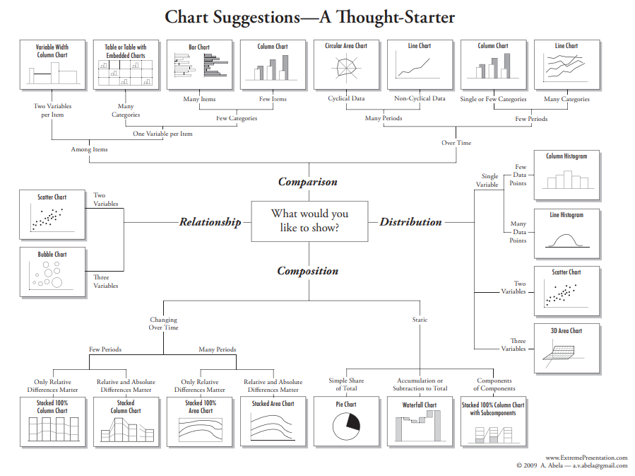|
|:--:|
| <b> Image Credits - Andrew Albela (@Arpi_2021) </b>|

While it may be missing some graphs (and includes pie charts), it is a great place to begin.  This type of guide might help us move away from always using bar and line graphs for everything.  Be careful, however, as new types of charts are being designed all the time.  Do not let yourself be pigeonholed into always using the same type of chart simply based on a recommendation.  Take some time to research new graphs and put them in your tool box.  A good exercise is to take the chart types that Albela suggests in his diagram and try to see which ones might work for each of the 4 quadrants of visualization types (declarative/ exploratory vs conceptual/ data-driven).

Once you have selected your visualization type, sketch it by hand.  You should always try two different chart types.  Suppose you want to compare income with the price of Apple products.  You may initially begin with a sketch like this.

|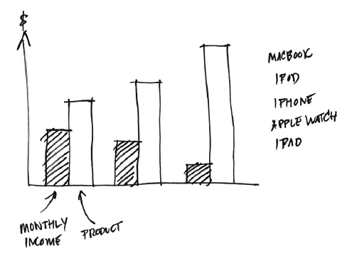|
|:--:|
| <b> Image Credits -  Berinato (@Berinato_2016) </b>|

This chart would be perfectly fine.  However, if you try a second type of visualization, you might actually stumble across something better.  Consider a mini-treemap.

|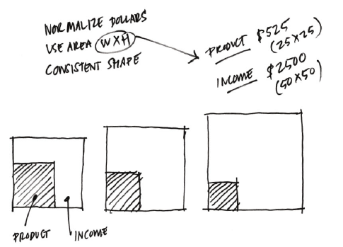|
|:--:|
| <b> Image Credits -  Berinato (@Berinato_2016) </b>|

This shows much clearer the ratio of income that would be spent on the product.  Ultimately, your second, third, fourth, etc. sketch may not be better than the original.  However, sketching various charts will definitely help clarify your thoughts and your message when you construct your final visual.

We will discuss different types of visualizations in the next chapter.

###  Prototype

The final 20 minutes of our hour is spent prototyping.  You know you're ready for this stage because your sketch matches what you are trying to say very closely, you're putting in actual data rather than just "faking it" and you generally are running out of ideas.

The prototype stage is iterative.  You create, you refine, you create some more, etc.  You should experiment with colour, size, shape, etc.  There is lots of software out there that can help at this step.  Don't be afraid to experiment to find what works best for your situation.

