#  Making Your Chart More Persuasive

##  Clearly Articulating Your Point

Of course, it is incredibly important to know your audience before you begin making a visualization.  With your audience in mind, consider what you are trying to tell them.  Is the presentation simply an informative presentation?  Are you trying to persuade someone?  Perhaps you have to impress someone with your visualization.  The point is that both the audience and purpose matters.

> Consider a non-profit group trying to fight suburban poverty.  One of the things the group is going to need to discuss is the increase in people in poverty living in the suburbs versus living in the city.  Below is a chart that shows how people in poverty have moved outside of the city into the suburbs.
>
|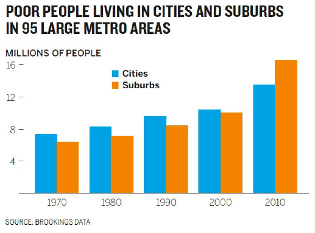|
|:--:|
| <b> Image Credits - Scott Berinato (@Berinato_2016) </b>|
>
>  What does this graphic say?  Somewhere between 2000 and 2010, the population shifted from being primarily in cities to primarily in the suburbs.  There is nothing wrong with it.
>
>  A better version is included below.
>
|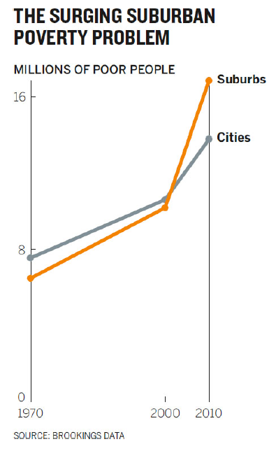|
|:--:|
| <b> Image Credits - Scott Berinato (@Berinato_2016) </b>|
>
>  The new version shows immediately the surge in poor people living in the suburbs since 2000.  The fact that we use the word "surge" to describe the second graph rather than the adjective "shift" or "increase", speaks to the increased power of persuasiveness in the second visualization.

The goal, when you are creating a graphic for persuasive purposes, is to create a graphic that leads to action.  It isn't simply enough that the chart is "true"; it needs to suggest a way forward.

The science of influence is a branch of psychology that plays a significant role in success.  Three strategies that we use to influence behaviour or thinking: economic, social and environmental.  

Economic strategies are carrot and stick types of strategies.  There are benefits to doing one thing and negative consequences to doing another.  Social strategies are often driven by outside influences.  we should be doing things one way because everyone else is doing it this way.  Environmental strategies include environmental factors like having relaxing music in hospitals and doctor's offices.  There are many examples of these types of strategies.  Changing the physical environment even slightly can have a huge impact on persuasion.

Persuasion in visualization works in a similar way.  Steve J. Martin writes: "Whilst we’d like to think that our decisions are the result of effortful cognition, the reality is somewhat different.  Much of our behaviour is driven by unconscious cues present in our
environment." (@Berinato_2016).

Even descriptions can be jazzed up in order to persuade your audience.  My house is 5 bedrooms, 4 bathrooms and nearly 4000 square feet with a small yard.  Conversely, my house can be described as a very large open-concept three story home, suitable for a large family, situated on a low-maintenance lot with golf course views out the back porch.  The point here is that one of these is descriptive while the other is persuasive.  

If you have a visualization and you have an opinion on how it should be interpreted, jazz it up so that it is interpreted the way you intended.  Use unconscious cues (Gestalt principles) like colour, contrast, space, words, what you show and what you leave out, to heighten the effect.

Here's another example.  The graph below is fine (though, it should probably be horizontal rather than vertical).  But, if you want to persuade people that beer is expensive at baseball games, this likely won't do it without a significant explaination from you.

|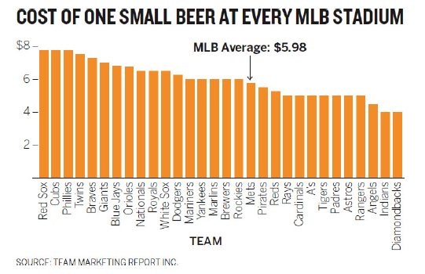|
|:--:|
| <b> Image Credits - Scott Berinato (@Berinato_2016) </b>|

The image below is far more persuasive.  It very quickly demonstrates how expensive beer is at baseball games.  Admittidely, it is slightly over the top, but it does drive the point home.

|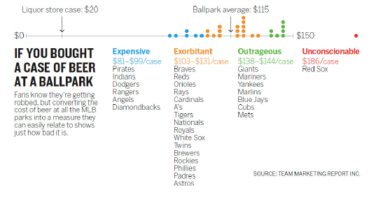|
|:--:|
| <b> Image Credits - Scott Berinato (@Berinato_2016) </b>|

##  Three Tips

>  Example:  Which graph convinces you that there is an issue with the west coast sales team?
>
|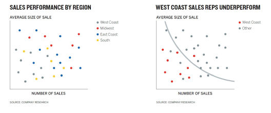|
|:--:|
| <b> Image Credits - Scott Berinato (@Berinato_2016) </b>|
>
>  While the graph on the left is more detailed, the main message is lost in the sea of details.  The graph on the right shows a much clearer story of the west coast sales team having problems.  Remember, details are not the key to getting your message across.  Making your message impossibly obvious is the key.

Scott Scott Berinato (@Berinato_2016) lays out three tips to persuade your audience. 

  1.  Hone the main idea,
  2.  Make it stand out,
  3.  Adjust what's around it.
  
###  Hone the Main Idea

Rather than approaching your data by asking "what am I trying to show", it is often times better to say "I need to convince them that...".  Consider the urban poverty example.  Rather than saying "I want to compare suburban and urban poverty", you would be better served by saying "I need to convince people that suburban poverty is a rapidly growing problem.

>  Example:  Rather than approaching your visualization with the statement:
> 
>  "I am trying to show how increasing hours spent on work isn't increasing productivity".
>
>  You may be better served approaching your visualization with the idea:
>
>  "I need to convince them that all this extra work we do is backfiring.  It's hurting the company's productivity rather than helping".
>

One thing to notice when you approach your visualization by trying to convince your audience is that the language changes and often is more emotional.  Your focus has changed from visualizing an idea to persuading someone that the idea is good.  You have gone from "I want you to know something" to "I need you to believe something".  From here, there is an automatic link between statistical terminology (increasing, declining, under-served, etc.) and words that elicit feelings (hurting, helping, hungry for).

###  Make it Stand Out

Here is where all the preattentive attributes and Gestalt principles come into play.

>  Example:  Look at how we change our poverty graph to come up with a final persuasive visual.
>
|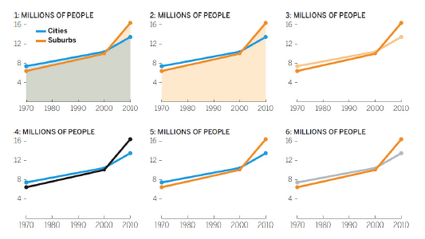|
|:--:|
| <b> Image Credits - Scott Berinato (@Berinato_2016) </b>|
>
>  Why do we not like the first 5 iterations?
>  1. The overlay of semitransparent colors creates a third color that dominates the chart and draws attention to the filled area, not the lines.
>
>  2. This clearly highlights suburban poverty more, but why is one shaded and one not? The shaded area is still distracting.
>
>  3. Darker and lighter hues of the same color suggest two variables in a group, not a comparison. The idea is to contrast, not complement.
>
>  4. Black on white provides the most contrast, but black and blue don’t contrast so much that the black line pops.
>
>  5. Better! But the blue is still fighting for attention.  The goal is to draw attention to the orange line.
>
>  6. Final color choice.

Other things to consider are the inclusion of demarcations, pointers and labels.  Here's an example where demarcations help editorialize the story.

|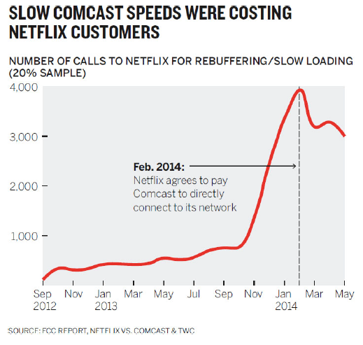|
|:--:|
| <b> Image Credits - Scott Berinato (@Berinato_2016) </b>|

>  Example:  The following chart is meant to emphasize the growing issue with student loans.
>
|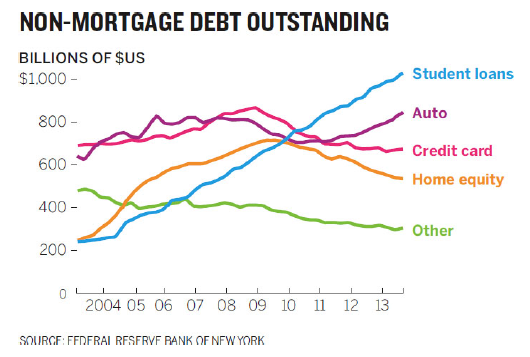|
|:--:|
| <b> Image Credits - Scott Berinato (@Berinato_2016) </b>|
>
>While it is factually correct and uses many correct visualization techniques, it suffers from the issue that the green line is the first thing we tend to see.  So, the solution is to emphasize the point of the graph.
>
|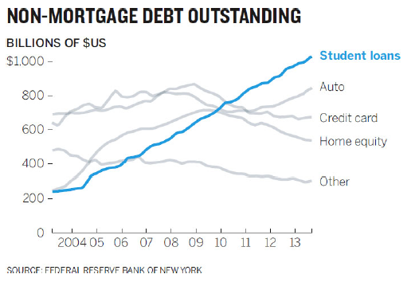|
|:--:|
| <b> Image Credits - Scott Berinato (@Berinato_2016) </b>|
>

Data visualization software does an exceptionally poor job at anticipating what visual cues we might want to inject into the visualization.  That should be expected, though.  Software renders data; but, good visualizations are all about presenting ideas.  So when you make a graph, take a few minutes and try to intervene and make use of techniques that bring your ideas to the forefront.

###  Adjust What is Around It

Remember, the point of the visualization is to highlight your message.  So, changing what is around the data is a great way to help craft your message.  Here are some hints:

  *  Remove reference points,
  *  Add reference points,
  *  Shift reference points.
  
>  Example:  This chart is meant to persuade us that there is an age divide in what people want from products.
>
|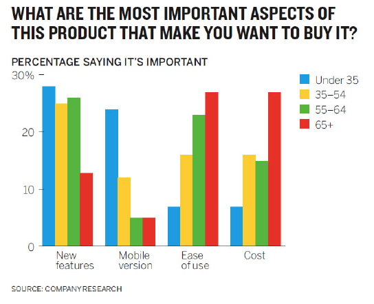|
|:--:|
| <b> Image Credits - Scott Berinato (@Berinato_2016) </b>|
>
>  If this graph does persuade you that there is an age divide, and I'm not 100% sure it does, did you come to that conclusion quickly?
>
>  By removing the reference points (yellow and green bars), the story is much clearer.  A new title also drives home the point we are trying to make.
>
|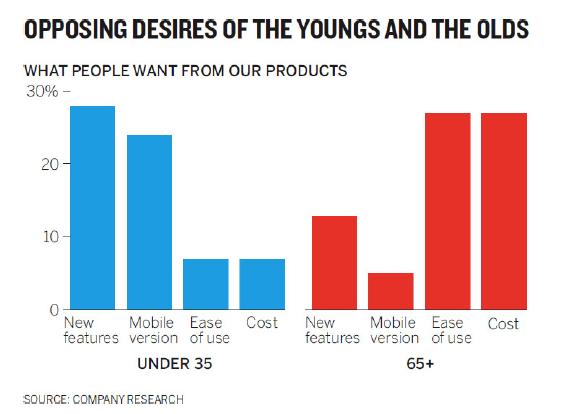|
|:--:|
| <b> Image Credits - Scott Berinato (@Berinato_2016) </b>|
>
>  This is a situation in which removing the unnecessary data helps bring the message into focus.

Intuitively, it might seem logical that removing data will always bring your story into focus.  After all, it removes visual distractions so your reader can focus only on the important data.  However, sometimes adding data can serve to add context.

The graph below would seem to indicate that vinyl records are making a comeback.

|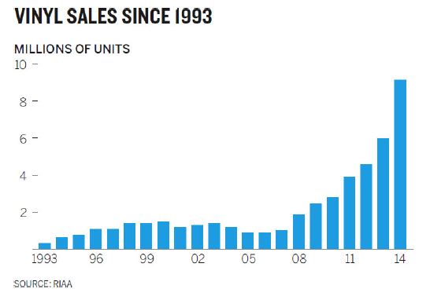|
|:--:|
| <b> Image Credits - Scott Berinato (@Berinato_2016) </b>|

The reality is that what appears to be a trend, is only a blip.  The addition of the reference point shows how small this increase really is.  It adds perspective to the story.

|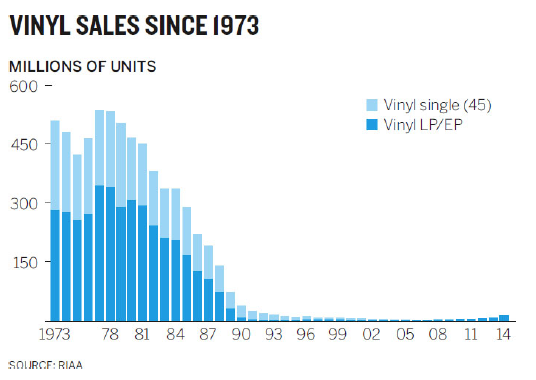|
|:--:|
| <b> Image Credits - Scott Berinato (@Berinato_2016) </b>|

Another way to think about this story is to shift the reference entirely.  While a resurgence might be taking place, it is minimal compared to music sales overall.

||
|:--:|
| <b> Image Credits - Scott Berinato (@Berinato_2016) </b>|

Another example of changing the reference is the beer at ballgames example.  A small beer is a different size depending on which ballpark you go to.  So, we're really looking at a cost per ounce.  People do not talk about the cost of an ounce of beer - but they do talk about the cost of a case of beer.  So, comparing it to that reference adds context to the story and allows us to compare to something that is well known.

Remember, while you do not want to distort the data, persuasion is fine.  There is no such thing as a 100% objective graph because our brains are not 100% objective.

||
|:--:|
| <b> Image Credits - Scott Berinato (@Berinato_2016) </b>|

Consider what is happening in the graph on the left.  There is an increase rising to a plateau, followed by an interval of decrease of roughly the same amount of time.  In the graph on the right, there is a sharp increase and the decrease is substantially more bumpy.  The stories are very different.  Except that they aren't.  They are the same graph with one adjusted for the computer (the left) and the other adjusted for a smartphone (right).  So, is one more objective than the other?  No, the size rescaled (correctly) to adjust for the medium.  Here we have the same data with a very different experience for the audience.

